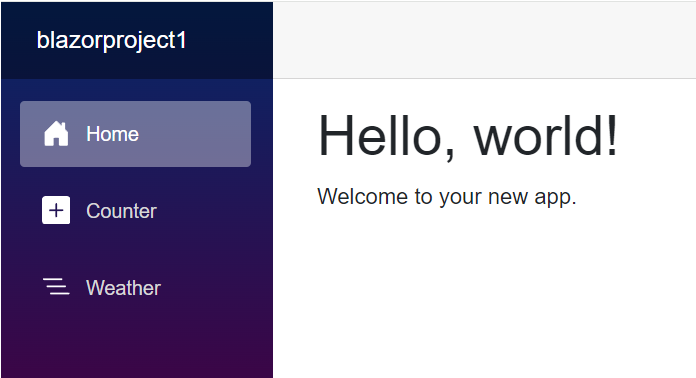
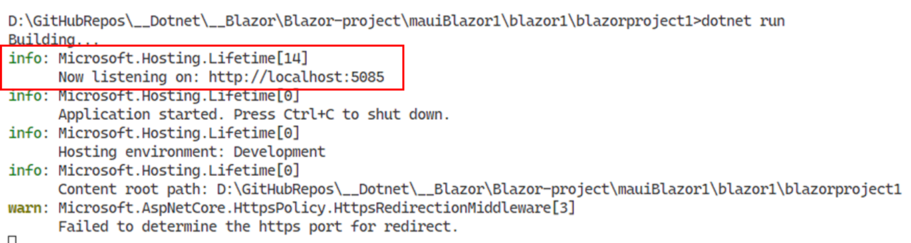
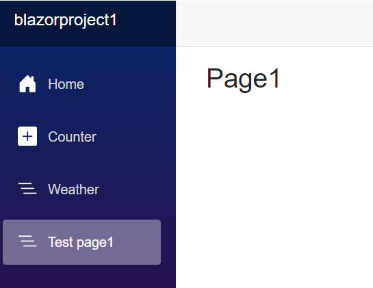

# สร้างหน้า blazor ใหม่

## Prerequisite

1. สร้าง project blazor

   ``` c
   dotnet new blazor -n blazorproject1 -o blazorproject1
   ```

2. ทดลองรัน project (ต้องอยู่ใน folder ของ project)

    ```
    dotnet run
    ```

**ผลที่ได้จากการรัน**



## ขั้นตอนการเพิ่มหน้า blazor

1. คำสั่งสร้างหน้า blazor ใหม่
    ```
    dotnet new razorcomponent -n <Page name>  -o Components/Pages
    ```
    เมื่อ  
    ```
    -n <Page name>  คือชื่อของ blazor page
    -o Components/Pages คือ location ของ file ที่ generate
    ```

   **ข้อควรระวัง**

    ``` 
    CSC : error RZ10011: Component 'page1' starts with a lowercase character. Component names cannot start with a lowercase character. [D:\GitHubRepos\__Dotnet\__Blazor\Blazor-project\mauiBlazor1\blazor1\blazorproject1\blazorproject 
    1.csproj]
    ```
    
    **สาเหตุ**

    ชื่อ razor page ต้องไม่ขึ้นต้นด้วย lowercase 
    ต้องขึ้นต้นด้วย Uppercase เท่านั้น

2. แก้ไขไฟล์  razor ที่สร้างขึ้นมา
    ``` razor
    @page "/Page1"
    @rendermode InteractiveServer
    <PageTitle> Page title </PageTitle>
    <h3>text </h3>
    @code {
    }
    ```
3. เพิ่มเส้นทางการเรียกไปยังหน้าที่เพิ่มเข้ามา
   1. แก้ไขในไฟล์ Components\Layout\NavMenu.razor
    ``` razor
    <div class="nav-item px-3">
        <NavLink class="nav-link" href="page1">
            <span class="bi bi-list-nested-nav-menu" aria-hidden="true"></span> Test page1
        </NavLink>
    </div>
    ```
4. ทดสอบโปรแกรม
   1. Build
   ```
   dotnet build
   ``` 
   
   2. Run
   ```
   dotnet run
   ``` 

5. เปิด web browse ตาม port ที่โปรแกรมรายงานมา




6. ทดสอบใช้งาน web




